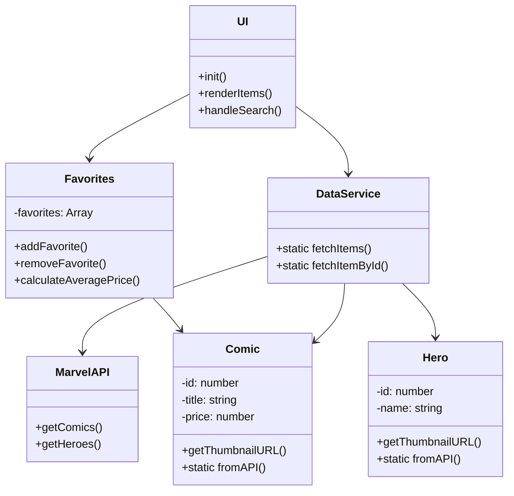
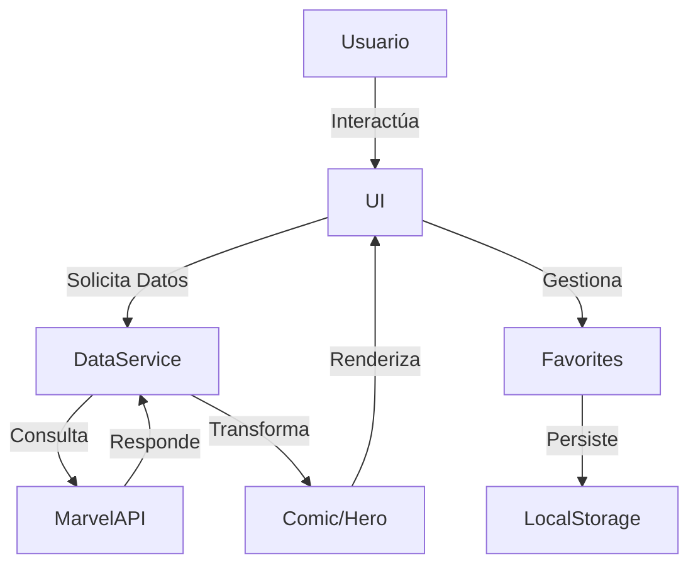
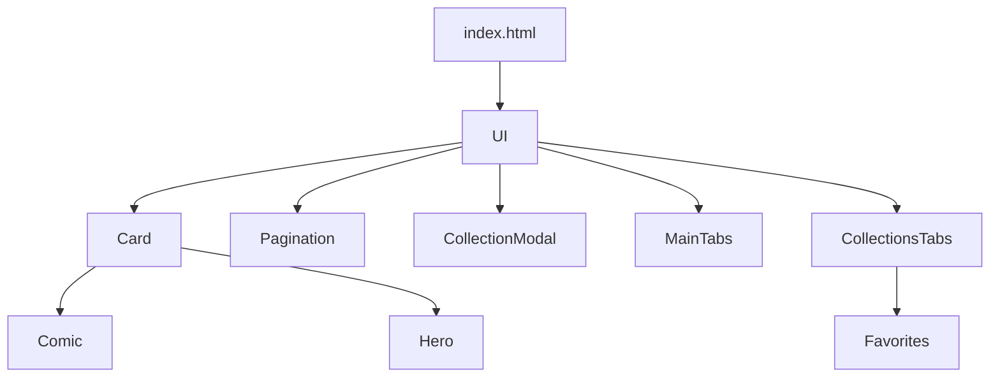
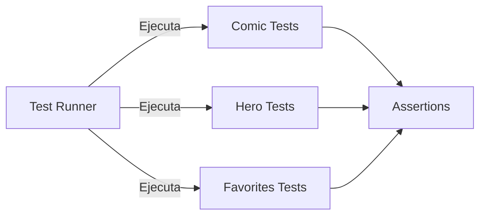
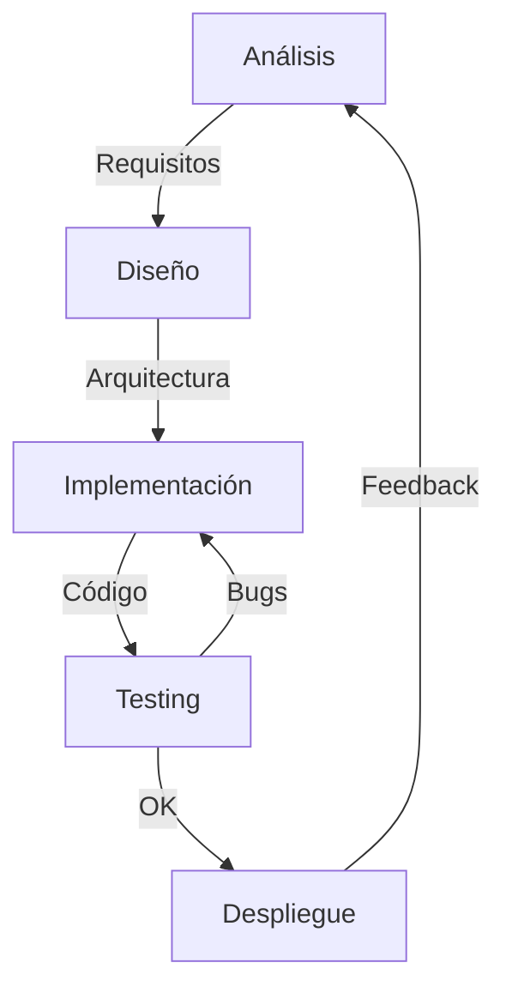

# Marvel Comics Explorer

## 📊 Diagramas

### Diagrama de Clases



### Diagrama de Flujo de Datos



### Diagrama de Componentes



## 🛠️ Tecnologías y Patrones

### Tecnologías Core

- JavaScript ES6+
  - Campos privados
  - Módulos ES6
  - Async/Await
- HTML5 & CSS3
  - Grid Layout
  - Flexbox
  - Variables CSS
- Marvel API
  - REST API
  - Autenticación Hash
- LocalStorage
  - Persistencia de datos
  - Gestión de estado

### Patrones de Diseño

1. **Singleton**

   - Gestión de estado global
   - Configuración centralizada
   - Instancia única de servicios

2. **Observer**

   - Sistema de eventos
   - Actualizaciones de UI
   - Comunicación entre componentes

3. **Factory**

   - Creación de componentes
   - Transformación de datos
   - Instanciación de objetos

4. **Proxy**
   - Validación de datos
   - Control de acceso
   - Caché de datos

### Principios SOLID

1. **Single Responsibility**

   - Clases con propósito único
   - Separación de responsabilidades
   - Cohesión alta

2. **Open/Closed**

   - Extensibilidad de componentes
   - Herencia y composición
   - Plugins y middleware

3. **Interface Segregation**

   - APIs específicas
   - Contratos claros
   - Dependencias mínimas

4. **Dependency Inversion**
   - Inyección de dependencias
   - Acoplamiento reducido
   - Inversión de control

## 📊 Características Técnicas

### Encapsulación

```javascript
class Comic {
  #id;
  #title;
  #price;

  constructor(id, title, price) {
    this.#validateData(id, title, price);
    this.#id = id;
    this.#title = title;
    this.#price = price;
  }
}
```

### Programación Funcional

```javascript
const affordableComics = comics
  .filter((comic) => comic.price <= maxPrice)
  .map((comic) => comic.title);
```

### Asincronía

```javascript
async function loadComics() {
  try {
    const response = await DataService.fetchItems("comics");
    return response.results;
  } catch (error) {
    console.error(error);
  }
}
```

## 🧪 Testing

### Tests Unitarios



### Cobertura

- Clases principales
  - Comic
  - Hero
  - Favorites
- Métodos críticos
  - addFavorite
  - calculateAveragePrice
  - findComicById
- Casos edge
  - Datos inválidos
  - Límites de paginación
  - Estado vacío

## 📱 Responsive Design

- Grid system adaptativo
- Media queries
- Mobile-first approach
- Flexbox layout

## 🔐 Seguridad

- Validación de inputs
- Sanitización de datos
- Control de acceso
- Manejo seguro de API keys

## 🚀 Performance

- Lazy loading
- Paginación eficiente
- Caché local
- Optimización de re-renders

## 📂 Estructura del Proyecto

```
marvel-comics/
├── index.html
├── tests.html
├── styles/
│   └── main.css
├── js/
│   ├── classes/
│   │   ├── Comic.js
│   │   ├── Hero.js
│   │   └── Favorites.js
│   ├── components/
│   │   ├── Card.js
│   │   ├── Pagination.js
│   │   └── ...
│   ├── services/
│   │   └── DataService.js
│   ├── api.js
│   ├── config.js
│   ├── ui.js
│   └── utils.js
└── README.md
```

## 🤝 Contribución

El proyecto está estructurado para facilitar contribuciones futuras:

- Código modular
- Documentación exhaustiva
- Tests automatizados

## 📝 Licencia

Este proyecto es parte de una práctica académica y utiliza la API de Marvel bajo sus términos y condiciones.

## 🎯 Objetivos Cumplidos

1. ✅ Implementación de clases base
2. ✅ Sistema de gestión de favoritos
3. ✅ Funciones recursivas y funcionales
4. ✅ Interfaz intuitiva y responsive
5. ✅ Tests completos

## 🔄 Ciclo de Desarrollo



## 📚 Referencias

- [Marvel API Documentation](https://developer.marvel.com/docs)
- [MDN Web Docs](https://developer.mozilla.org/)
- [JavaScript Design Patterns](https://www.patterns.dev/)
