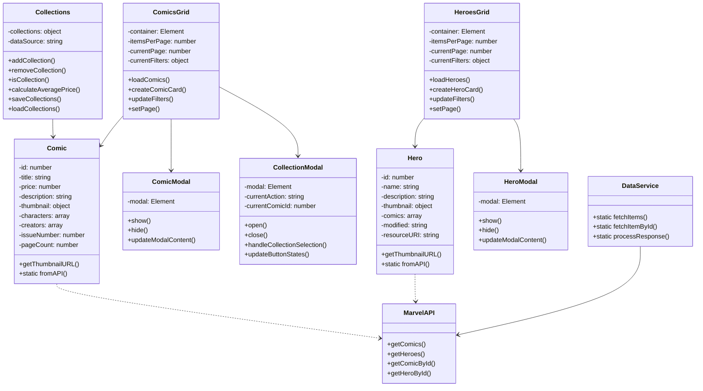
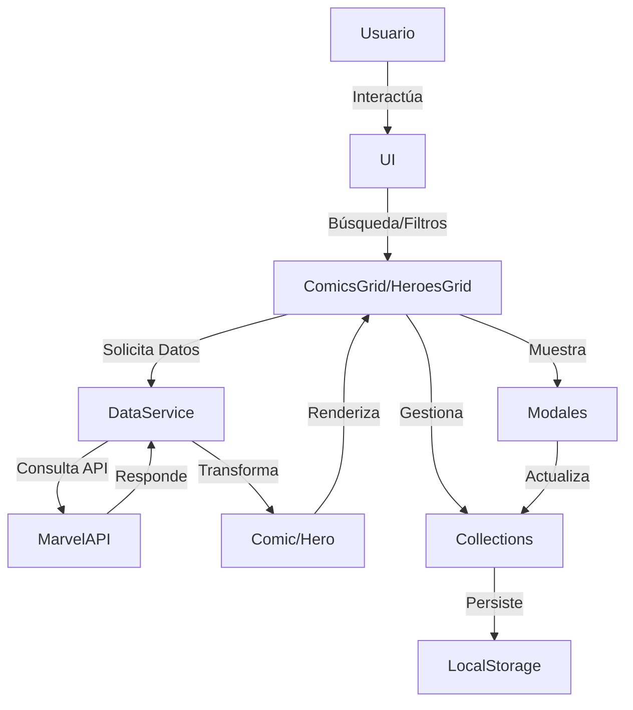
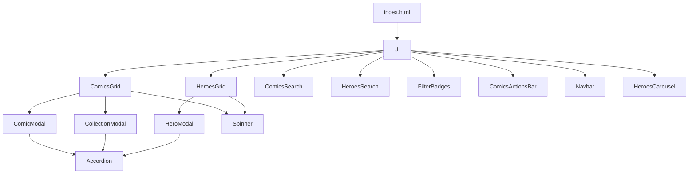
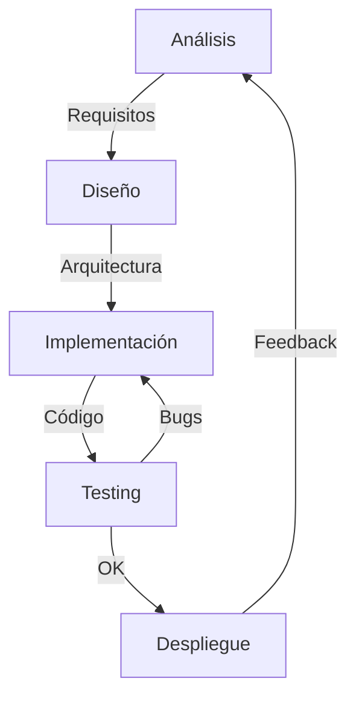

# Marvel Comics Explorer

## 📊 Diagramas

### Diagrama de Clases



### Diagrama de Flujo de Datos



### Diagrama de Componentes



## 🛠️ Tecnologías y Patrones

### Tecnologías Core

- JavaScript ES6+
  - Clases y Herencia
  - Módulos ES6
  - Async/Await
  - LocalStorage
- HTML5 & CSS3
  - Grid Layout
  - Flexbox
  - Variables CSS
  - Animaciones
- Marvel API
  - REST API
  - Autenticación Hash
  - Endpoints de Comics y Heroes

### Patrones de Diseño

1. **Singleton**

   - Gestión de estado global (Collections)
   - Configuración centralizada
   - Instancia única de modales

2. **Observer**

   - Sistema de eventos para actualizaciones
   - Comunicación entre componentes
   - Manejo de cambios en colecciones

3. **Factory**

   - Creación de componentes UI
   - Transformación de datos API
   - Instanciación de modelos

4. **Proxy**
   - Validación de datos
   - Control de acceso
   - Caché de datos

## 📊 Características Principales

### Gestión de Comics

- Búsqueda por nombre, ID y héroe
- Filtrado por precio
- Vista detallada en modal
- Paginación dinámica

### Gestión de Héroes

- Búsqueda por nombre e ID
- Vista detallada con comics relacionados
- Carrusel de héroes populares
- Paginación avanzada

### Sistema de Colecciones

- Múltiples colecciones (Wishlist, Por Leer, Leyendo, Leídos, Favoritos)
- Mover y clonar comics entre colecciones
- Validación de duplicados
- Persistencia en LocalStorage

### Interfaz de Usuario

- Diseño responsive
- Animaciones fluidas
- Feedback visual (toasts)
- Modales interactivos

## 📂 Estructura del Proyecto

```
marvel-comics/
├── index.html
├── comics.html
├── heroes.html
├── collections.html
├── styles/
│   ├── comics.css
│   ├── heroes.css
│   ├── comicModal.css
│   ├── collection-modal.css
│   ├── navbar.css
│   └── spinner.css
├── js/
│   ├── models/
│   │   ├── Comic.js
│   │   ├── Hero.js
│   │   └── Collections.js
│   ├── components/
│   │   ├── ComicsGrid.js
│   │   ├── HeroesGrid.js
│   │   ├── ComicModal.js
│   │   ├── CollectionModal.js
│   │   ├── FilterBadges.js
│   │   ├── Spinner.js
│   │   └── Accordion.js
│   ├── controllers/
│   │   ├── comics.js
│   │   ├── heroes.js
│   │   └── collections.js
│   ├── services/
│   │   ├── MarvelAPI.js
│   │   ├── DataService.js
│   │   └── Config.js
│   └── utils/
│       └── utils.js
└── assets/
    └── images/
```

## 🔄 Ciclo de Desarrollo



## 📚 Objetivos Cumplidos

1. ✅ Sistema de búsqueda y filtrado avanzado
2. ✅ Gestión completa de colecciones
3. ✅ Interfaz moderna y responsive
4. ✅ Modales interactivos
5. ✅ Persistencia de datos
6. ✅ Optimización de rendimiento

## 📚 Referencias

- [Marvel API Documentation](https://developer.marvel.com/docs)
- [MDN Web Docs](https://developer.mozilla.org/)
- [JavaScript Design Patterns](https://www.patterns.dev/)

## 📝 Licencia

Este proyecto es parte de una práctica académica y utiliza la API de Marvel bajo sus términos y condiciones.

Data provided by Marvel. © 2014 Marvel
